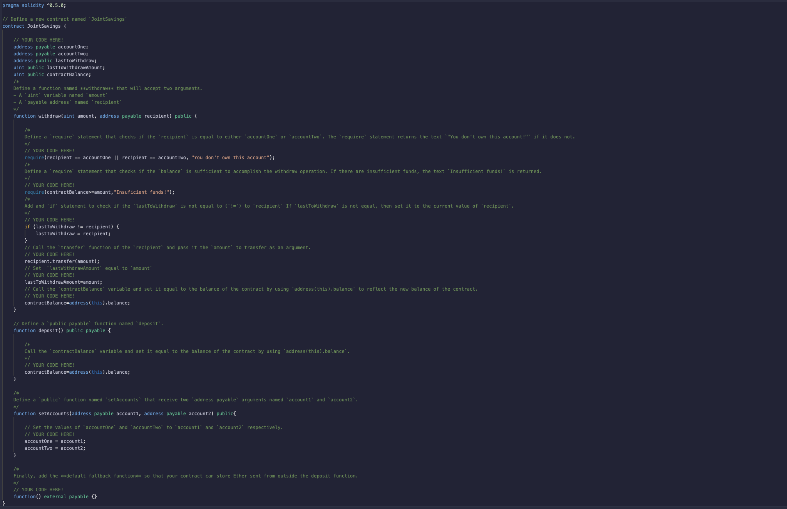
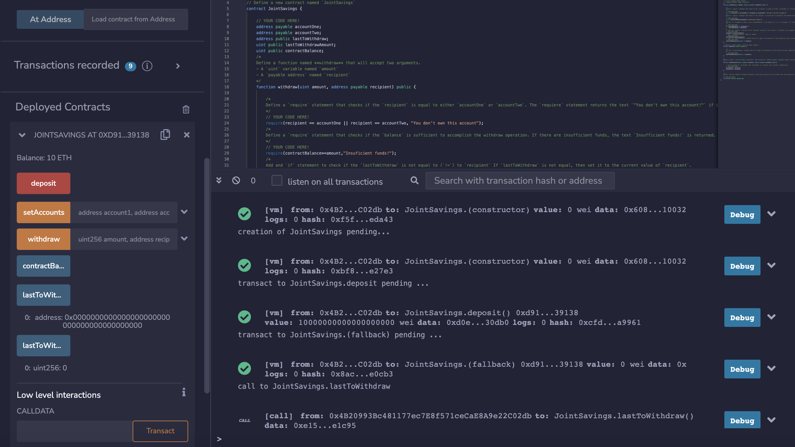

# Solidity Smart Contract
I created a Solidity smart contract that accepts two user addresses. These addresses will be able to control a joint savings account. Your smart contract will use ether management functions to implement a financial institution’s requirements for providing the features of the joint savings account. These features will consist of the ability to deposit and withdraw funds from the account.

## Running REMIX IDE
In order to run the contract, you will need to use Remix IDE. You will not have to installed anything, you can just access their website.

* [Remix IDE](https://remix.ethereum.org/)

## The Contract
The following image is the code that runs in order to run the transaction between the accounts.

## Transaction
The image below shows how the contract can run different types of actions such as deposit, withdraw
